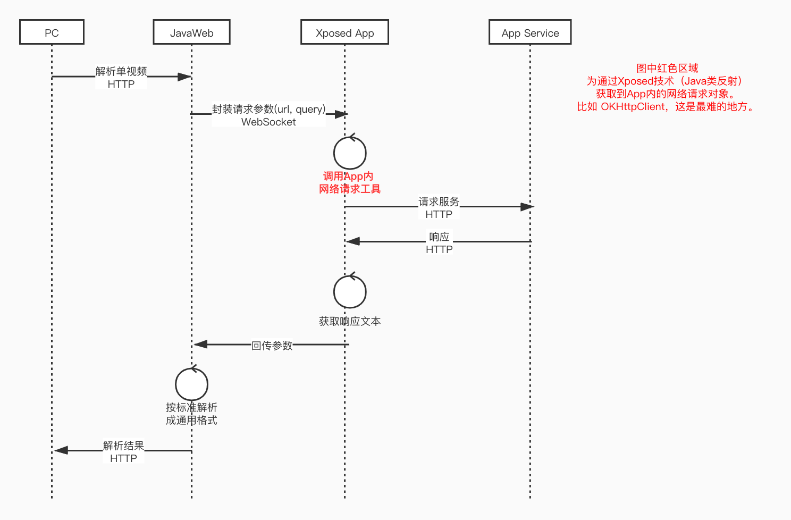

## 成品网站地址 [http://x.bensee.com.cn/](http://x.bensee.com.cn/)
## 源码购买 http://www.huzhan.com/ishop35733/

## 本网站请求时序图



## 使用技术和工具

主要: Frida, Xposed, Jadx(反编译APK), Charles(网络抓包工具, HTTPS), 雷电模拟器,  Java, Android

附加: React, Websocket

> 上述工具使用方法自行寻找，这里不做教学， star 超800，开源全部代码

## Hook点寻找思路
1. 看是否使用 `OKHttpClient`、`Retrofit`
2. 看有没有网络请求工具类 `NetworkUtils`、`HttpUtils`
3. 使用 Frida 对可能的地方进行Hook，在App上操作下，看是否有日志打印出来

## 寻找Hook 点示例
以 `Retrofit` 网络请求框架为例，
#### 验证流程
> 1. 使用Frida 对 `retrofit2.Retrofit#create` 进行Hook 打印简单日志。 验证是否为`Retrofit`框架
> 2. 对 `okhttp3.OkHttpClient#newCall` 进行Hook 看是否每次请求都会有日志

#### 理论基础
> App 源开发者会在网络请求上签名过滤器。破解so 或者加签规则比较麻烦。我们直接从源头上下手。
> 1. 查看 `retrofit2.Retrofit` 源码得知， 里面有一个  `final okhttp3.Call.Factory callFactory` 的属性
> 我们自己写一个Android程序。获得到 `callFactory` 后发现他可以直接进行网络请求，并且附加在okHttpClient上的过滤器都会生效
> 
>  ```java
> okhttp3.Call.Factory callFactory = x;
> Request.Builder builder = new Request.Builder();
> builder.url("https://www.baidu.com");
> builder.get();
> String response = callFactory.newCall(builder.build()).execute().body().string();
> ```
> 


#### 理论成立。实战开始
> 1. 使用`Xposed` 对 `retrofit2.Retrofit#create` 进行Hook
> 
> ```java
> XposedHelpers.findAndHookMethod("retrofit2.Retrofit", lpparam.classLoader, "create", Class.class, new > XC_MethodReplacement() {
>     @Override
>     protected Object replaceHookedMethod(MethodHookParam param) throws Throwable {
>         Object o = XposedBridge.invokeOriginalMethod(param.method, param.thisObject, param.args);
>         Object callFactory = XposedHelpers.getObjectField(param.thisObject, "callFactory");
>         return o;
>     }
> });
> ```
> 
> 2. 使用Xposed的规范，进行类反射调用Apk内对象
> 
> ``` java
> Object builder = XposedHelpers.newInstance(XposedHelpers.findClass("okhttp3.Request.Builder", classLoader));
> builder = XposedHelpers.callMethod(builder, "url", "https://www.baidu.com");
> builder = XposedHelpers.callMethod(builder, "get");
> Object request = XposedHelpers.callMethod(builder, "build");
> 
> Object call = XposedHelpers.callMethod(callFactory, "newCall", request);
> Object response = XposedHelpers.callMethod(call, "execute");
> Object body = XposedHelpers.callMethod(response, "body");
> System.out.println(body)
> ```
> 


## 附录
> 1. [我使用过的Frida调试脚本](./docs/frida-scripts/)，因为不同版本的apk进过混淆后，可能会类名发生变化。请自行替换
> 2. Xposed、和部分App的安装包 https://pan.baidu.com/s/1QEn2POM-30PbEa7oEz-3xg 提取码:tuvh 
> 3. frida 官网 [https://frida.re/](https://frida.re/)
> 4. 简书-Xposed开发初体验 [https://www.jianshu.com/p/275a45b8095b](https://www.jianshu.com/p/275a45b8095b)
> 5. 查看当前活动的Activity
> 
> ```shell
> adb shell dumpsys activity | grep -i run
> ```
> 
> 6. Jadx 反编译，反混淆，不编译资源包
> 
> ```shell
> jadx --show-bad-code --deobf -r
> ```